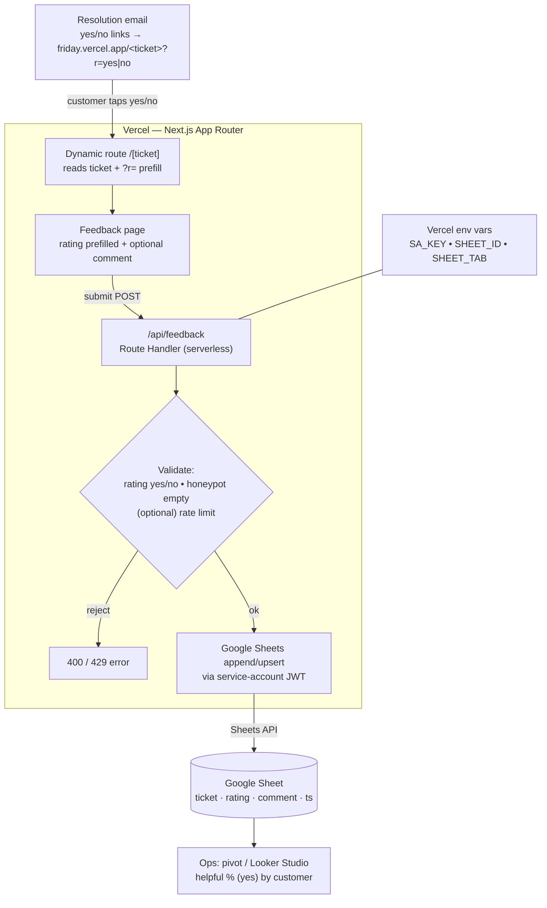

# Friday Ticket Feedback — High-Level Design (Draft v0.1)

**Status:** Implemented — §5, §7, §11 and parts of §14 are superseded by [`friday_feedback_signed_links_hld.md`](friday_feedback_signed_links_hld.md) (signed link IDs)
**Owner:** Srijan
**Build agent:** Claude Code
**Last updated:** 2 Jul 2026

---

## 1. Purpose

A lightweight web app that collects a customer yes/no rating — "was the AI's response helpful?" — (+ optional comment) for a specific support ticket and writes it to a Google Sheet. The customer reaches it via a link embedded in the resolution email, e.g. `friday.vercel.app/TKT-93849`. Tapping Yes or No opens the page with that answer pre-selected; the customer submits and the response lands in a sheet keyed to the ticket number.

---

## 2. Goals / Non-goals

**Goals**
- One shareable link per ticket, of the form `friday.vercel.app/<ticket>`.
- Feedback page: yes/no rating (pre-filled from the link) + optional comment.
- On submit, append/upsert the response to a Google Sheet.
- Deployable on Vercel with minimal config.

**Non-goals (this version)**
- No auth / login for customers.
- **No HMAC / signed tokens** — routing is on the raw ticket number (accepted tradeoff, see §11).
- No in-app dashboard — analysis happens in the Google Sheet / Looker Studio.
- No DevRev write-back yet (listed as future work, §14).

---

## 3. Architecture overview



Flow: customer clicks a yes/no link in the resolution email → dynamic route renders the feedback page with the answer pre-filled → customer submits → serverless API validates and writes to Google Sheets → ops reads the sheet.

---

## 4. Tech stack

| Layer | Choice |
|---|---|
| Framework | Next.js (App Router, JavaScript) |
| Hosting | Vercel |
| Serverless | Next.js Route Handler (`app/api/feedback/route.js`) |
| Data sink | Google Sheets (Sheets API v4) |
| Auth to Sheets | Google service account (JWT) |
| Rate limit (optional) | `@upstash/ratelimit` + `@upstash/redis` |
| Styling | Plain CSS (inline `globals.css`), no UI framework required |

---

## 5. URL & routing design

- **Route:** `app/[ticket]/page.jsx` → matches `friday.vercel.app/TKT-93849`.
- **Rating prefill:** optional query param `?r=yes` or `?r=no` (case-insensitive). Yes/No links in the email point to `friday.vercel.app/<ticket>?r=yes`. No signing — the param is a convenience only; the real value is captured by what the customer submits.
- **Ticket validation:** accept a simple pattern (e.g. `^[A-Za-z0-9\-]{3,40}$`). Reject anything else with a friendly "invalid link" state. (No lookup against DevRev in this version.)
- Root path `/` renders a minimal placeholder ("This link opens from your support email"). No public index of tickets.

---

## 6. Feedback page behavior (`/[ticket]`)

- Read `ticket` from the route param; read `r` from the query string.
- Render: heading, ticket number (display only), a yes/no selector (pre-filled from `r`), an optional comment textarea, a submit button.
- Client-side guardrails: rating required (`yes` or `no`); comment optional, max ~1000 chars.
- Include a hidden honeypot input named `website` (must stay empty; bots fill it).
- On submit → `POST /api/feedback`. Show a success ("Thanks — your rating for `<ticket>` is recorded") or error state inline.
- Accessible: keyboard-operable yes/no radiogroup (arrow keys + enter), visible focus, `prefers-reduced-motion` respected, works down to ~360px mobile.

---

## 7. API contract — `POST /api/feedback`

**Request body (JSON)**
```json
{
  "ticket": "TKT-93849",
  "rating": "yes",               // "yes" or "no" (case-insensitive)
  "comment": "Quick resolution, thanks",
  "customer": "Flipkart",        // optional, may be passed via ?c= on the link
  "website": ""                  // honeypot — must be empty
}
```

**Server-side validation**
- `ticket` matches the allowed pattern.
- `rating` is `yes` or `no` (trimmed, lower-cased; anything else rejected).
- `comment` length ≤ 1000; strip control characters.
- `website` is empty → else silently return 200 without writing (bot).
- (Optional) rate-limit by IP.

**Responses**
| Code | Body | When |
|---|---|---|
| 200 | `{ "ok": true }` | Written (or honeypot silently dropped) |
| 400 | `{ "ok": false, "error": "<reason>" }` | Validation failed |
| 429 | `{ "ok": false, "error": "rate_limited" }` | Too many requests (if rate limit enabled) |
| 500 | `{ "ok": false, "error": "server_error" }` | Sheets write failed |

---

## 8. Google Sheets integration

**Data model — one tab, header row:**

| ticket | rating | comment | submitted_at | customer | user_agent |
|---|---|---|---|---|---|
| TKT-93849 | yes | Quick resolution, thanks | 2026-07-02T10:14:00Z | Flipkart | Mozilla/5.0… |

**Write strategy**
- **MVP:** always `spreadsheets.values.append` (simplest; multiple rows per ticket allowed, latest wins during analysis).
- **Preferred:** upsert by ticket — read column A, find the row for `ticket`; if present, `update` that row, else `append`. One CSAT per ticket.

**One-time setup (document in README so it can be reproduced):**
1. Create a Google Cloud project; enable the **Google Sheets API**.
2. Create a **service account**; generate a **JSON key**.
3. Create the destination Google Sheet; copy its **spreadsheet ID** from the URL.
4. **Share the sheet** with the service account's email (`…@….iam.gserviceaccount.com`) as **Editor**. ← this is what grants write access.
5. Add the credentials to Vercel env vars (§9).

---

## 9. Environment variables

| Var | Purpose |
|---|---|
| `GOOGLE_SERVICE_ACCOUNT_KEY` | Service-account JSON, stored as a single-line string or base64 (decode in `lib/sheets.js`) |
| `SHEET_ID` | Target spreadsheet ID |
| `SHEET_TAB` | Tab/worksheet name (e.g. `Feedback`) |
| `UPSTASH_REDIS_REST_URL` | *(optional)* rate limiting |
| `UPSTASH_REDIS_REST_TOKEN` | *(optional)* rate limiting |

All secrets are server-side only. Never referenced from client components. Provide a committed `.env.local.example` with empty values.

---

## 10. Project structure (files Claude Code should create)

```
friday-feedback/
├─ app/
│  ├─ layout.jsx                 # root layout, fonts, metadata (noindex)
│  ├─ page.jsx                   # minimal root placeholder
│  ├─ globals.css
│  ├─ [ticket]/
│  │  └─ page.jsx                # feedback form (server shell + client form)
│  └─ api/
│     └─ feedback/
│        └─ route.js             # POST handler → validate → Sheets
├─ lib/
│  └─ sheets.js                  # service-account client + append/upsert
├─ next.config.js                # security + noindex headers
├─ package.json
├─ .env.local.example
└─ README.md                     # setup + deploy steps (from §8, §9, §13)
```

**Dependencies:** `next`, `react`, `react-dom`, `googleapis`. Optional: `@upstash/ratelimit`, `@upstash/redis`.

---

## 11. Known tradeoff — raw ticket in the URL

Routing on the plain ticket number means links are **guessable** and feedback could in theory be **spoofed** (someone submitting on a ticket that isn't theirs). Accepted for this version to keep it simple. Cheap mitigations included instead:
- Honeypot field to filter bots.
- Optional IP rate limiting.
- Upsert by ticket, so a ticket can't be flooded with duplicate rows.

If spoofing becomes a real concern, the upgrade path is signed tokens (`/f/<hmac-token>`) — see §14. No schema change needed; only the route and the email link change.

---

## 12. Compliance / non-functional

- **No indexing:** `robots` meta `noindex, nofollow` in `layout.jsx` metadata **and** `X-Robots-Tag` header in `next.config.js`; `robots.txt` disallow all.
- **Security headers** (in `next.config.js`): `X-Frame-Options: DENY`, `X-Content-Type-Options: nosniff`, `Referrer-Policy: no-referrer`.
- **No customer identity in the URL:** the slug is the internal ticket ID only (not a company/contact name), which is fine; any customer name is passed as data, not in the path.
- **Errors** are plain and actionable, in the interface's voice (e.g. "This link has expired or is invalid").
- **Performance:** static-ish page, single POST; cold start acceptable.
- **Accessibility & mobile:** keyboard support, focus states, reduced-motion, responsive to ~360px.

---

## 13. Setup & deploy sequence

```bash
# 1. Scaffold + install
npx create-next-app@latest friday-feedback   # JS, App Router, no Tailwind needed
cd friday-feedback
npm install googleapis
# optional: npm install @upstash/ratelimit @upstash/redis

# 2. Add env vars locally (.env.local) and on Vercel (Project → Settings → Env Vars)

# 3. Run locally
npm run dev        # visit http://localhost:3000/TKT-TEST?r=4

# 4. Deploy (preview first, then prod)
vercel deploy
vercel deploy --prod
```

---

## 14. Future enhancements

- **Signed tokens** (`/f/<token>`, HMAC) to stop spoofing and hide ticket IDs.
- **DevRev write-back:** post the CSAT onto the ticket as a custom field or timeline note.
- **DevRev ticket validation** before showing the form (confirm the ticket exists / is closed).
- **Looker Studio** dashboard on the sheet: helpful % (share of `yes`) by customer — feeds the Flipkart-first resolution-rate work.
- Email-builder helper to generate the yes/no links per ticket.

---

## 15. Acceptance criteria (Claude Code — verify before handoff)

- [ ] `friday.vercel.app/TKT-93849` renders the feedback page.
- [ ] `?r=yes` pre-selects Yes on load (`?r=no` pre-selects No).
- [ ] Submitting a rating (with/without comment) writes a correct row to the sheet.
- [ ] Re-submitting the same ticket updates its row (if upsert implemented).
- [ ] Missing/invalid rating is blocked client- and server-side.
- [ ] Honeypot-filled request returns 200 but writes nothing.
- [ ] Invalid ticket pattern shows the "invalid link" state.
- [ ] No secrets appear in client bundles; page is `noindex`.
- [ ] Page is keyboard-navigable and works on a ~360px mobile viewport.

---

## 16. Build constraints for Claude Code

- **Do not commit or push anything.** Generate the files locally and stop; the repo owner will review and commit manually.
- Keep it a single Next.js app; no extra services beyond Sheets (Upstash optional and behind env flags).
- Prefer clear, minimal code over abstraction — this is a small, single-purpose app.
