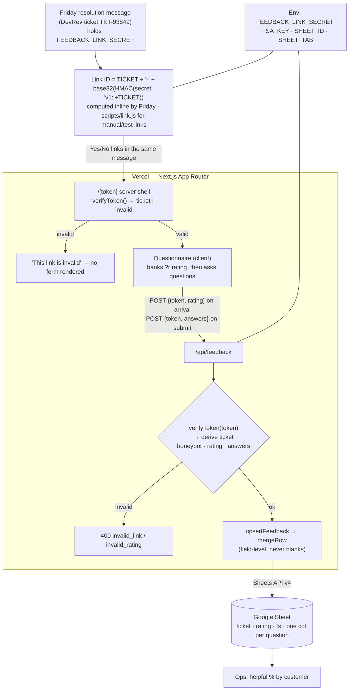

# Friday Ticket Feedback v2 — Signed Link IDs + Interactive Form (HLD v0.2)

**Status:** Draft for review — supersedes §5, §7, §11 and parts of §14 of [`friday_feedback_hld.md`](friday_feedback_hld.md)
**Owner:** Srijan
**Build agent:** Claude Code
**Last updated:** 27 Aug 2026

---

## 1. Why this change

v0.1 routes on the raw DevRev ticket number (`/TKT-93849`). Anyone who guesses a
ticket ID can open the form and submit feedback for a ticket that isn't theirs —
and `POST /api/feedback` accepts a bare `ticket` string from the client, so the
form isn't even needed to forge a row.

v2 fixes that and makes the form worth landing on:

1. **A signed link ID** derived from the ticket number with a shared secret key.
   Deterministic (same ticket + same key → same ID, forever), reproducible by
   anyone holding the key, and verifiable server-side with **no database and no
   lookup table**.
2. **The token is the only accepted input.** The ticket number is *derived* from
   a verified token; the client can never assert a ticket directly.
3. **A questionnaire on the website.** The Yes/No tap is recorded through the
   API the moment the link is opened — yes/no is never a control on the page.
   What the customer lands on is three short questions that diagnose *why*
   Friday missed (§7.3), submitted once and merged into the same row.

**Not in scope:** DevRev write-back, dashboards, customer auth, link expiry
(see §12).

---

## 2. The link ID

### 2.1 Shape

```
https://friday.vercel.app/TKT-93849-K7QF4X9M?r=yes
                          └───┬────┘ └───┬──┘
                           ticket      tag (8 chars, 40-bit HMAC)
```

The token is `<canonical ticket>-<tag>`. The tag is a truncated HMAC-SHA256 over
the ticket, keyed with `FEEDBACK_LINK_SECRET`.

### 2.2 Algorithm (normative — do not change without a version bump)

```
canonical(t) = t.trim().toUpperCase()            // must match ^[A-Z0-9-]{3,40}$
mac          = HMAC_SHA256(key = FEEDBACK_LINK_SECRET (utf8),
                           msg = "v1:" + canonical(t))
tag          = crockford32( mac[0..4] )          // first 5 bytes = 40 bits = 8 symbols
token        = canonical(t) + "-" + tag
```

- **Crockford base32 alphabet:** `0123456789ABCDEFGHJKMNPQRSTVWXYZ` (no I, L, O,
  U — nothing that gets misread when a support agent retypes a link).
- **5 bytes → 8 symbols exactly.** Implementation: `mac.readUIntBE(0, 5)` (40
  bits is exact in a JS Number), then emit 8 base-32 digits, most significant
  first.
- **`"v1:"` prefix** is inside the MAC input. It costs nothing and lets a future
  scheme coexist with links already sitting in customer inboxes.
- **Two audiences, two scopes — DEFERRED, not built.** Ships with the engineer
  form (§13.4). Design, for when it does: the customer link MACs `"v1:" + ticket`,
  the internal link MACs `"v1:i:" + ticket`. Same ticket, two tags, neither
  forgeable from the other, so a customer editing the URL cannot reach the
  internal form. The customer scope is byte-identical to what the Friday spec
  publishes, so adding the internal scope changes **no published vector**:
  `TKT-93849-NFWSZCQ6` (customer) and `TKT-93849-2M6YQW80` (internal), under the
  doc's test secret. Until then `verifyToken` returns the ticket string — one
  scope, one code path.

### 2.3 Parsing and verification

```
verify(input):
  s = input.trim().toUpperCase()
  if s.length < 12 or s.length > 49          -> invalid   // 3+1+8 .. 40+1+8
  if s[-9] != "-"                            -> invalid
  ticket = s[0 .. -10]                       // everything before the final "-"
  tag    = normalizeCrockford(s[-8 ..])      // I,L -> 1   O -> 0
  if ticket does not match ^[A-Z0-9-]{3,40}$ -> invalid
  for each secret in acceptedSecrets():
      if timingSafeEqual(tag, expectedTag(ticket, secret)) -> valid, return ticket
  invalid
```

- The tag is a **fixed 8 characters**, so the split point is unambiguous even
  though the ticket itself contains hyphens. No new separator character is
  introduced — this deliberately avoids a `.` in the path segment, which Vercel's
  router can mistake for a static file extension.
- `crypto.timingSafeEqual` over the two 8-byte ASCII buffers, after an explicit
  length check (length is not secret; `timingSafeEqual` throws on a mismatch).
- **Fail closed.** If `FEEDBACK_LINK_SECRET` is unset or empty, `verify()`
  returns invalid for *every* input. A missing env var must never open the door.

### 2.4 Key rotation

`acceptedSecrets()` = `[FEEDBACK_LINK_SECRET, ...split(FEEDBACK_LINK_SECRETS_ACCEPTED, ",")]`.
Generation always uses the primary; verification accepts any listed secret. To
rotate: move the current value into `FEEDBACK_LINK_SECRETS_ACCEPTED`, set a new
primary, and drop the old one once outstanding emails have aged out. One
`.split()` — worth it, because this secret gets handed to a message-sending
pipeline and will eventually need replacing.

### 2.5 Why this shape (and what was rejected)

| Option | Verdict |
|---|---|
| **`<ticket>-<hmac tag>`** | **Chosen.** Stateless O(1) verify, deterministic, reproducible from the key alone, ticket stays legible for ops. |
| Opaque ID = `hash(ticket)` only | Rejected. Nothing to verify *against* — the server would have to try every known ticket, or keep a lookup table. Breaks the "no storage" property. |
| `base64url(payload).sig` (JWT-ish) | Rejected. Same security, more bytes, and base64 hides nothing (it decodes to the ticket anyway). |
| Random ID + DB row per link | Rejected. Needs a store and a generation step that can fail; not reproducible from a shared key, which is the explicit requirement. |

**40 bits of tag** is the deliberate cut. Forging a link for a *known* ticket
takes ~1.1 × 10¹² guesses; at 100 req/s that is ~350 years, and every wrong guess
is rejected before any Google Sheets call (§6.3), so it costs us nothing. This is
why **no rate limiter comes back** — the HMAC is the rate limiter.

**The ticket number stays visible in the URL.** Accepted: it is the recipient's
own ticket, and a readable slug makes support debugging and sheet keying trivial.
If it ever needs hiding, that requires the rejected lookup-table design.

---

## 3. Generating links (the Friday side)

**Friday mints the URL itself. There is no call to friday-feedback to get a
link, and no minting endpoint exists.** Friday holds `FEEDBACK_LINK_SECRET`,
computes the tag inline while composing the message, and drops the finished URL
into the same reply as its answer.

This works because the URL is **self-describing**: the ticket is right there in
the path, and the tag is the proof. When the link is opened, friday-feedback
reads the ticket out of the path, recomputes the tag with the same secret, and
compares — match means real, mismatch means someone typed a URL (§2.3). No
shared state, no round-trip at mint time, no lookup at open time. Both sides
only ever need the key.

### 3.1 Mint inline with the shared key

Any language, three lines. This *is* the "shared key can recreate it" property
the design is built around.

```js
// scripts/link.js  →  node scripts/link.js TKT-93849
const { createHmac } = require('node:crypto');
const A = '0123456789ABCDEFGHJKMNPQRSTVWXYZ';
const t = process.argv[2].trim().toUpperCase();
const n = createHmac('sha256', process.env.FEEDBACK_LINK_SECRET)
  .update('v1:' + t).digest().readUIntBE(0, 5);
let tag = ''; for (let i = 7; i >= 0; i--) tag += A[Math.floor(n / 32 ** i) % 32];
console.log(`${process.env.APP_BASE_URL}/${t}-${tag}`);
```

The same snippet lives in the README so the Friday pipeline can port it (Python:
`hmac.new(key, b"v1:"+t, "sha256").digest()[:5]`).

### 3.2 Email/message link pair

```
Was this helpful?   [ Yes ](https://…/TKT-93849-K7QF4X9M?r=yes)   [ No ](…?r=no)
```

`?r=` stays an unsigned convenience param, exactly as in v0.1 — it only chooses
which answer is pre-filled/auto-submitted. It is not a security boundary; the
token is.

### 3.3 Rejected: a `GET /api/link` minting endpoint

Considered and dropped (owner decision, 27 Aug 2026). It would have avoided
distributing the secret and made rotation a one-place change, but it costs a
network hop on every outgoing message, a second secret to guard the endpoint,
and a new failure mode where a Sheets-unrelated 500 silently ships a message
with no feedback link. Friday can hold a secret, so the key stays shared and the
mint stays local. If rotation pressure ever makes this worth revisiting, §2.4
already lets the two schemes overlap.

---

## 4. Architecture



The key property: **the ticket written to the sheet is always derived from a
verified MAC**, never read from request input.

---

## 5. Routing

| Route | Change |
|---|---|
| `app/[token]/page.jsx` | **Renamed** from `app/[ticket]/page.jsx`. Verifies the token, derives the ticket, renders the form or the invalid state. |
| `app/page.jsx` | Unchanged placeholder. |
| `app/api/feedback/route.js` | Now takes `token`, not `ticket`. |

**One dynamic route, not two.** Keeping `/[ticket]` alongside a new `/f/[token]`
would leave the unsigned path as a permanent bypass. Renaming the existing param
is both the smallest diff and the thing that closes the hole: a bare
`/TKT-93849` now simply fails verification and shows the invalid state.

**No migration needed.** The app has never gone live (the Sheets service account
is still unprovisioned — see the v0.1 checklist), so there are no links in the
wild. Hard cutover, no back-compat shim.

---

## 6. API — `POST /api/feedback` (v2)

The endpoint is the **only** place a rating can be set (§7.1). It accepts two
independent kinds of write, in either order, against the same row:

| Write | Payload | Sent by |
|---|---|---|
| **Rating** | `{token, rating}` | The page, on arrival, from `?r=yes\|no` — or any machine caller holding a minted token. |
| **Questionnaire** | `{token, answers}` | The page, when the customer submits the form. |

### 6.1 Request

```json
{
  "token":   "TKT-93849-NFWSZCQ6",
  "rating":  "no",
  "answers": {
    "cust_problem": ["didnt_match", "explained_only"],
    "outcome":      "human",
    "cust_needed":  "the COD reconciliation for hub BLR-3"
  },
  "customer": "",
  "website":  ""
}
```

`rating` and `answers` are each **optional**; at least one must be present.
`ticket` is not in the contract at all — it is derived from `token`.

Because the token *is* the capability, a machine caller needs no other
credential: minting a token for a ticket (spec §3) and POSTing
`{token, rating}` is the whole integration. That is what "yes/no is API-only"
buys — the signal can come from the email tap, from DevRev, or from Friday
itself, with no new auth surface.

### 6.2 Field-level merge (a deliberate reversal)

**Only the fields present in a request overwrite the row.** An absent field
leaves its cell as it was.

The earlier draft of this design specified complete-payload overwrites. That
was correct when the form was the single writer. It is wrong now: the rating and
the answers arrive from two independent writes, so a full overwrite would mean
the questionnaire submit blanks the rating recorded thirty seconds earlier — or
a rating POST wipes the answers. Merging per field is ~5 lines and removes the
hazard entirely.

`submitted_at` is written once, on row creation. `updated_at` on every write.

### 6.3 Validation

| Field | Rule |
|---|---|
| `website` | Honeypot. Non-empty → `200 {ok:true}`, write nothing. |
| `token` | `verifyToken()` → ticket, else `400 invalid_link`. |
| `rating` | If present: `yes` \| `no` after trim+lowercase, else `400 invalid_rating`. If absent: column B untouched. |
| `answers` | Object keyed by question id. Unknown ids and unknown option values are **dropped silently** — a schema change while a page is open must not 400 a real customer. Per-type rules in §7.3. |
| neither `rating` nor `answers` | `400 empty_payload` — a silent no-op would hide a client bug. |
| `customer` | ≤ 120 chars, control chars stripped. Untrusted label metadata, same trust level as free text. |

### 6.4 Order of operations (matters)

`honeypot → verifyToken → rating → answers → Sheets`. Everything before the
Sheets call is pure CPU, so forged traffic never reaches Google.

### 6.5 Responses

| Code | Body |
|---|---|
| 200 | `{ok:true}` |
| 400 | `{ok:false,error:"invalid_json"\|"invalid_link"\|"invalid_rating"\|"empty_payload"}` |
| 500 | `{ok:false,error:"server_error"}` |

Malformed token and bad MAC return the identical code and message — no oracle
for which half was wrong.

---

## 7. The website — a questionnaire, not a rating widget

### 7.1 Three modes, decided by how the link was opened

| Opened as | Mode | Page |
|---|---|---|
| `?r=yes` | **THANKS** | Records the rating, says "Thanks for rating". Asks nothing — the tap was the whole interaction. |
| `?r=no` | **QUESTIONS** | Records the no, then asks the three questions (§7.3). No rating control. |
| no `?r` | **FORM** | The classic page: *"Was the response helpful?"* Yes/No plus a comment box — and the reason questions appear the moment they pick No. |

**FORM is the only mode with a rating control** (owner decision, 27 Aug 2026,
superseding an earlier "yes/no is API-only, never in the UI" rule). Why it is
safe there: a bare link has no rating to record, so without a control it is
either a dead end or it asks *"what was wrong?"* of someone who never said
anything was. The arrival links are untouched.

FORM keeps the v0.1 requirement that a rating is chosen before submitting
("Please choose Yes or No."). The comment is optional in every mode.

The reveal uses **the same `showWhen` gate as the arrival links** — the rating is
just in-page state there instead of a URL param, so there is no second
mechanism. Switching back to Yes collapses the questions, and only questions
**currently on screen** are submitted, so a chip picked and then abandoned is
never written.

The rating still reaches the API two other ways: the arrival POST from `?r=`, and
a machine POSTing `{token, rating}` directly (§6.1).

### 7.2 Page flow

```
open /TKT-93849-NFWSZCQ6?r=no
  → verify token (server)          invalid → "this link is invalid", nothing else
  → valid: render the three questions (no rating control)
  → on mount, POST {token, rating:"no"}     ← the rating is now banked
  → customer answers what they feel like answering
  → Submit → POST {token, rating, answers}  ← merged into the same row
  → thanks state

open /TKT-93849-NFWSZCQ6      (no ?r — the classic form)
  → Yes/No + comment; nothing recorded yet
  → pick No  → the reason questions appear inline
  → pick Yes → they collapse again; the comment box stays
  → Submit → POST {token, rating, answers}  ← one write, one row
```

Two things this buys:

- **The rating survives a bounce.** It is recorded before the customer decides
  whether to answer anything, which is the whole reason it is decoupled.
- **Every question is optional.** The row already exists, so Submit is allowed
  with nothing filled in, and there is a plain "No thanks" exit that just shows
  the thanks state.

The arrival POST is fired **client-side after mount**, not during the server
render: HTML-only email scanners and link prefetchers execute no JS, so they
record nothing. It is idempotent — the ticket-keyed upsert means a reload
overwrites its own row rather than adding one.

### 7.3 Question schema — two audiences

**Grounded in an internal evidence review** — 73 DevRev tickets read in full,
~40 carrying a real human correction. The full taxonomy, with ticket references
and verbatim corrections, is held internally as
`docs/sdd/friday_fr_failure_taxonomy.md` and is deliberately **not** published
here: it names customers and individual tickets. Three
findings from that sweep force the shape of this section:

1. **Friday's FR usually never reaches the customer.** In the carrier slice 11 of
   13 tickets had no external FR at all — a human wrote the real reply. Six more
   were relayed but silently truncated. So asking only the customer "was the AI
   helpful?" measures nothing about Friday on most tickets.
2. **Only the support engineer can see the failure.** Every recurring failure is a
   delta between Friday's RCA and ground truth — *blamed our config for the
   customer's own bad softdata*, *concluded "no such order" from a failed lookup*.
   A customer cannot answer that. The engineer who corrected it can, and their
   corrections average **under 15 words**, captured nowhere.
3. **RCA correctness is already measured; FR quality is not.**
   `ai_agent_session_metrics` covers task_completion/faithfulness automatically,
   the continuous-improvement Human Review blocks cover *investigation*
   correctness, and an internal bot already asks a CX Lead "was the RCA correct?
   Yes/No". None of them touches the First Response. **That is the gap this app
   fills** — so it must not re-ask for an RCA verdict or a confidence rating.

Hence two link scopes (§2.2) over one row per ticket: the customer answers what
they experienced, the engineer answers what was wrong. Both merge into the same
row (§6.2), which is the point — *"customer said no"* beside *"engineer said the
date filter explained it"* is the pairing that makes the data actionable.

```js
// lib/questions.js — audience decides which link renders the question.
export const QUESTIONS = [
  // ————— customer link —————
  { id: 'cust_problem', audience: 'customer', type: 'multi', max: 3, showWhen: 'no',
    label: 'What was wrong with it?',
    options: [
      { value: 'asked_what_i_sent', label: "It asked for details we'd already sent" },
      { value: 'already_tried',     label: "It suggested things we'd already tried" },
      { value: 'cant_do_it',        label: "We couldn't find or do what it suggested" },
      { value: 'didnt_match',       label: "It doesn't match what we're seeing in the system" },
      { value: 'pushed_back',       label: 'It pushed this back to us or another team' },
      { value: 'no_fix',            label: 'It explained the problem but nothing got fixed' },
    ] },
  { id: 'outcome', audience: 'customer', type: 'single',
    label: 'Did you get what you needed in the end?',
    options: [
      { value: 'self',  label: 'Yes — I worked it out myself' },
      { value: 'human', label: 'Yes — after a person stepped in' },
      { value: 'open',  label: 'No — still not sorted' },
    ] },
  { id: 'cust_needed', audience: 'customer', type: 'text', maxLength: 1000, showWhen: 'no',
    label: 'In one line — what did you need us to do?' },

  // ————— internal link (support engineer) —————
  { id: 'fr_disposition', audience: 'agent', type: 'single',
    label: "What happened to Friday's first response?",
    options: [
      { value: 'sent_asis',   label: 'Sent it as-is' },
      { value: 'sent_edited', label: 'Edited it, then sent' },
      { value: 'wrote_own',   label: 'Ignored it, wrote my own' },
      { value: 'sent_none',   label: 'Nothing went to the customer' },
    ] },
  { id: 'rca_value', audience: 'agent', type: 'single',
    label: 'How much did the investigation help you?',
    options: [
      { value: 'saved_time',  label: 'Saved me real time' },
      { value: 'useful_hint', label: 'Useful hint — I still did the work' },
      { value: 'no_help',     label: 'No help' },
      { value: 'misled',      label: 'Sent me down the wrong path' },
    ] },
  { id: 'rca_delta', audience: 'agent', type: 'multi', max: 3,
    label: 'What did you have to correct?',
    options: [
      { value: 'nothing_wrong',        label: 'Nothing — it was right' },
      { value: 'simpler_cause',        label: 'A simpler cause explained it (date range, filter, wrong screen)' },
      { value: 'wrong_party',          label: 'Blamed the wrong side — us / their data / the carrier' },
      { value: 'absence_as_proof',     label: "Concluded \"it doesn't exist\" from a failed lookup" },
      { value: 'missed_own_evidence',  label: 'The answer was in data it had already pulled' },
      { value: 'known_lever',          label: 'Missed the standard action for this account' },
      { value: 'withheld_the_fix',     label: "Knew the key or permission but wouldn't put it in the FR" },
      { value: 'design_vs_defect',     label: 'Called designed behaviour a bug, or a bug by-design' },
      { value: 'asked_for_what_it_had',label: 'Asked for details already on the ticket' },
      { value: 'no_data_access',       label: 'Had no data for this org and answered anyway' },
      { value: 'shouldnt_have_run',    label: "Wasn't a real ticket, or I'd already answered" },
    ] },
  { id: 'actual_cause', audience: 'agent', type: 'text', maxLength: 1000,
    label: 'What was the actual root cause?' },
];
```

**Three types only** — `single` (radiogroup), `multi` (toggle chips, capped by
`max`), `text` (textarea + counter). A 1–5 scale would be a `single` with numeric
values, so no fourth type is needed. The schema drives the form, the server-side
validation and the sheet's column headers.

#### The customer "no" branch — every option is real pushback

These six are what customers actually wrote back when Friday's FR was wrong.
Phrased in the first-person plural because that is how these tickets are written
("we have already contacted your team") — the respondents are ops teams, not
individual consumers.

| Option | What it tells you | Where it came from |
|---|---|---|
| `asked_what_i_sent` | Friday couldn't read the attachment and asked for what was already on the ticket. **The largest class** — ~24 clarifying questions across the sample, and not one was ever used by a human. | Most frequent in the sample: ~24 clarifying questions were asked across the reviewed tickets and not one was ever used by a human. |
| `already_tried` | It proposed a remediation checklist without reading the thread. | Observed: a customer replying that they had already force-stopped, cleared cache, reinstalled and tried a second device — minutes after receiving that exact checklist. |
| `cant_do_it` | The suggested action doesn't exist in their portal, or doesn't apply to their setup. Often caused by Friday's own disclosure rule substituting an invented UI path for the real config key. | Observed: a customer unable to find the menu the FR named, because the FR substituted an invented UI path for the real permission key. |
| `didnt_match` | Friday's conclusion contradicts what the customer can see. **The most diagnostic option** — it is the customer-side signature of the bag-recon date-filter class, where Friday declares a backend problem and the customer's screen shows nothing pending. | Observed: a customer's screen showing nothing pending minutes after the FR declared a backend fault and the ticket auto-resolved. |
| `pushed_back` | Correct owner, wrong deliverable — the requester was the person who needed the how-to, or the fix was ours and got handed to them. | Observed: a store user told three times to consult their manager, when they were the person who needed the how-to; and a customer told to stop their retry loop while a Shipsy-side toggle would have unblocked them. |
| `no_fix` | The diagnosis may be right and the customer is still blocked. Separates *wrong* from *right but useless*, which the rating alone cannot. | Observed: a customer chasing four times after a correct diagnosis that committed Shipsy to an action nobody owned. |

**Dropped after drafting:** a *"came too late"* option — real (three tickets where
the human had already answered before Friday posted) but it is visible from
timestamps without asking, and it would spend a chip a customer will not tap.
And no *"Something else"* catch-all: a catch-all absorbs taps that would
otherwise land on a specific option, and produces a column nobody can act on.
The free-text question covers the tail.

**What a customer cannot tell us, so we don't ask:** whether the root cause was
right. They have no way to know. That question belongs to the engineer's form,
and asking the customer for it would manufacture noise that looks like data.

`cust_needed` asks *"what did you need us to do?"* rather than "anything else?"
because these customers write in actions — *"we need an immediate and clear
response confirming the current exact location and status"*. Asking for the
action is what makes the answer usable.

#### Every `rca_delta` option is an observed failure, not a guess

| Option | Observed | Taxonomy |
|---|---|---|
| `simpler_cause` | 5+ | The bag-recon date filter. Friday asserted "no customer-side workaround exists, escalate to backend"; the human wrote *"use correct date range"*. It turns self-serve fixes into engineering escalations. |
| `absence_as_proof` | 7 | *"The order was never received by Shipsy"* — while the carrier booking error sat in the logs. The most frequent shape, and it shifts blame to the customer's upstream. |
| `wrong_party` | 5+ | Blamed our unit conversion for a customer's genuinely malformed inbound data; blamed our own database for a screen that proxies the carrier's API; pointed a customer at their ERP when our own team had changed config minutes earlier. Runs **both** directions. |
| `asked_for_what_it_had` | ~24 questions, 0 used | Friday can't read `.eml` or screenshots, so it asks for what's already attached. |
| `withheld_the_fix` | 4 | Friday's own disclosure rule bans config keys from the FR. It identified `dashboard_consignment_trip_unassign` at 9/10, withheld it, invented a menu path that doesn't exist, and auto-resolved. |
| `missed_own_evidence` | 4 | `vn_used: "backup_greenvn"` sat in 11 payloads it had fetched; *"Requested trip has been deleted"* sat in its own ES results. |
| `known_lever` | 5 | "Repush the manifest", "allocate N-series inventory" — routine in these accounts; its pattern table reports *"No matching pattern"* for exactly these. |
| `design_vs_defect` | 3 | A UAT-agreed flow called a bug on a **P1**; a missing code path called "working as designed". |
| `no_data_access` | 3 | 38 tools failed with `ORGANISATION_NOT_FOUND` and it still authored a causal story. |
| `shouldnt_have_run` | ~28 | ~17% skipped on unmapped org_id; ~6 full RCAs on auto-mailers and OOO loops; and cases where the human had already answered two minutes earlier. |
| `nothing_wrong` | 4+ | Friday out-researches the human on most tickets and was strictly better on several. Without this option the loop only ever hears failures. |

#### Why `fr_disposition` and `rca_value` are separate questions

The RCA is frequently valuable when the FR is worthless — Friday's best
investigation in the sample (a customer ERP retry loop, 265 calls in 5h) shipped
with its worst FR. Scoring them as one number destroys exactly the signal that
tells you which half to fix. `fr_disposition` also surfaces the list-truncation
rendering bug for free: a run of `sent_edited` on one engineer means something
different from a run of `sent_none`.

#### Deliberately not asked

- **Any confidence rating.** Friday's own score does not predict correctness —
  mean 6.4/10 when contradicted vs 6.8/10 when endorsed, noise across 43 cases,
  with 9/10s flatly wrong and 4/10s relayed intact. Asking a human to re-score it
  would add a column with the same defect.
- **"Was the RCA correct? Yes/No."** Already asked of a CX Lead by an internal
  bot, and already approximated by `ai_agent_session_metrics`. `rca_delta` is
  strictly more informative.
- **"Would you like someone to follow up?"** — no DevRev write-back exists (§12),
  so the app cannot honour it. Goes in with write-back.
- **A 1–5 satisfaction score, and anything identifying.** The ticket already
  identifies the customer.

#### Two rules that keep historical data readable

1. **Question ids are append-only and never reused.** Array order is column order
   (§8). Ids are semantic (`outcome`, not `q2_outcome`) so appending never makes a
   numeric prefix a lie.
2. **Changing a question's meaning means a new id**, not an edited label.

`ponytail:` array order doubles as column order — reordering later needs a
one-time sheet migration. Fine at this scale.

#### `showWhen` — display rule, not validation

- `showWhen: 'no'` renders a question only when the rating is `no` — the `?r=`
  value on an arrival link, or the in-page selection on the classic form. One
  gate, both cases.
- `cust_needed` carries **no** gate. That is what makes a comment available even
  on a Yes; its label switches to the sharper *"what did you need us to do?"*
  once the rating is `no` (`labelNo`). Same id, same column, same meaning.
- This is a **partial reversal of §7.4's "no branching"**, and the line is
  precise: gating on the *rating* is a one-line filter over a single piece of
  state, with no conditional validation and no effect on the sheet.
- **Still skipped:** gating on *another answer* ("ask X only if Y was Z").
- Not enforced by the API. An unrendered question simply never appears in
  `answers`, so its cell is never written. Server-side enforcement would protect
  nothing — a caller holding a valid token can write whatever the schema allows.
- `audience` ships with the deferred engineer form (§13.4), not now.

### 7.4 Explicitly skipped

**Answer-dependent** branching (ask X only if the answer to Y was Z — gating on
the *rating* is in, §7.3), required-field enforcement, per-question incremental
saves (one Submit, one write — the earlier draft's 600 ms chip debounce is gone
with the affordance it served), pagination or a multi-step wizard, progress bars,
"edit my answers" after submit, and an "already answered" pre-check (a Sheets
read on every page load). Add any of these when someone asks for the data they'd
produce.

Accessibility carries over unchanged and now applies per question type:
roving-tabindex radiogroups with arrows/Home/End for `single`, an
`aria-pressed` toggle group for `multi`, a persistent `sr-only`
`aria-live="polite"` region for status, focus moved to the confirmation heading
on submit, visible focus rings, `prefers-reduced-motion`, 360 px.

---

## 8. Google Sheet schema

**Six fixed columns, then one column per question, generated from the schema.**

Six fixed columns, then one per question in schema order — A–M with the §7.3 set
(`cust_problem`, `outcome`, `cust_needed`, `fr_disposition`, `rca_value`,
`rca_delta`, `actual_cause`).

| | A ticket | B rating | C submitted_at | D updated_at | G cust_problem | H outcome | J fr_disposition | L rca_delta |
|---|---|---|---|---|---|---|---|---|
| customer answered | `TKT-93849` | `no` | 10:14:02 | 10:15:31 | `didnt_match,explained_only` | `human` | | |
| …then the engineer | `TKT-93849` | `no` | 10:14:02 | 16:40:09 | `didnt_match,explained_only` | `human` | `wrote_own` | `simpler_cause` |

The second row is the same row after the internal link was used. **That pairing is
the deliverable** — the customer's experience and the engineer's diagnosis on one
line, which is only possible because writes merge per field (§6.2) and both link
scopes key on the same ticket.

- `HEADER_ROW = [...PREFIX, ...QUESTIONS.map(q => q.id)]`. With the §7.3 set
  that is A–M. Headers are written from the schema, so adding a question appends
  a column with no code change.
- **A gated question leaves its cell empty.** Empty means "not asked" (wrong
  audience, or rating was `yes`) *and* "asked but skipped". Tell them apart by
  column B and by whether any column for that audience is filled — never by the
  cell alone. Worth knowing before writing a formula over column G.
- **The dedicated `comment` column is gone.** Free text is a `text` question
  like any other, which is what keeps the schema single-sourced.
- `multi` answers are stored comma-joined in the schema's option order (not tap
  order), so `too_generic,needed_action` is always spelled the same way and groups cleanly in
  a pivot.
- Ranges are computed, not hard-coded: `A:{lastCol}` from the header width, via
  a small `colLetter()` helper that handles `AA`+ (past 20 questions).
- `ensureHeader` rewrites the header row when it is missing **or shorter than**
  `HEADER_ROW`, so the tab self-heals as questions are appended. Rows written
  under an older, shorter schema are padded on read.
- `neutralizeFormula` still applied to every free-text and generated cell, so a
  CSV export or Looker re-import can't execute customer text as a formula.

The read-then-write upsert remains non-atomic (the Sheets values API has no
compare-and-set). With two writers the exposure is now slightly wider: a rating
POST and a questionnaire POST landing in the same instant could each merge onto
the same pre-read row, and the later write would drop the earlier one's field.
In practice they are seconds apart — tap, read, fill, submit. `ponytail:`
accepted ceiling; a short per-ticket lock is the upgrade if it ever bites.

---

## 9. Files

```
lib/token.js              NEW  ~45 lines — canonical, tag, makeToken, verifyToken, acceptedSecrets
lib/token.test.js         NEW  node:test — see §11
lib/questions.js          NEW  ~80 lines — question schema (2 audiences) + showWhen + sanitizeAnswers + colLetter
scripts/link.js           NEW  ~10 lines — CLI generator for manual/test links 
app/[token]/page.jsx      MOVED from app/[ticket]/ — verify, derive ticket, pass token to the form
app/[token]/Questionnaire.jsx MOVED from FeedbackForm.jsx — arrival rating POST + schema-driven form
app/api/feedback/route.js  EDIT — token in place of ticket, answers, merge, order of ops
lib/sheets.js             EDIT — computed ranges, question columns, field-level merge
app/globals.css           EDIT — question block, chip + scale styles, thanks state
.env.local.example        EDIT — new vars
README.md                 EDIT — secret generation, the 3-line HMAC recipe, link usage
```

**No new dependencies.** `node:crypto` is stdlib; `node --test` is the stdlib
test runner. Dependency list stays `next`, `react`, `react-dom`, `googleapis`.

---

## 10. Environment

| Var | Required | Purpose |
|---|---|---|
| `FEEDBACK_LINK_SECRET` | **yes** | HMAC key, 32 bytes of entropy — `openssl rand -base64 32` or `-hex 32`, whichever you prefer. It is used as a literal utf8 string, so the encoding is cosmetic and environments need not match formats. What matters: **a distinct value per environment**, and the same value on the Friday side of that environment. A mismatch is silent — links simply read as invalid. |
| `FEEDBACK_LINK_SECRETS_ACCEPTED` | no | Comma-separated old secrets, accepted on verify only (§2.4). |
| `APP_BASE_URL` | for link gen | e.g. `https://friday.vercel.app`, no trailing slash. Also needed on the Friday side. |
| `GOOGLE_SERVICE_ACCOUNT_KEY`, `SHEET_ID`, `SHEET_TAB` | yes | Unchanged. |

All server-only; `lib/token.js` is never imported from a client component (the
token string is passed down as a prop, the secret never crosses the boundary).
Rotating `FEEDBACK_LINK_SECRET` invalidates every outstanding link unless the old
value is moved to `FEEDBACK_LINK_SECRETS_ACCEPTED` first — say this out loud in
the README.

---

## 11. Test — `lib/token.test.js` (`node --test`)

One file, stdlib `assert`, no framework. Required vectors:

1. **Known-answer vector.** A hard-coded `(secret, ticket) → tag` triple.
   This is the important one: it locks the algorithm so a future refactor can't
   silently invalidate every link already sitting in a customer's inbox.
2. `verifyToken(makeToken(t))` round-trips and returns the canonical ticket.
3. Case-insensitive: lowercase token verifies; `I/L/O` in the tag normalize.
4. Tampered tag (one char flipped) → invalid.
5. Bare ticket with no tag → invalid. Tag with no ticket → invalid.
6. Wrong secret → invalid. Secret listed in `FEEDBACK_LINK_SECRETS_ACCEPTED` → valid.
7. **Unset `FEEDBACK_LINK_SECRET` → every input invalid** (fail-closed).

Plus `lib/questions.test.js` for the schema layer: unknown ids and option
values dropped, `multi` deduped/ordered/capped, text trimmed and truncated, and
the merge cases that matter — a questionnaire write must not blank an
API-recorded rating, and a rating write must not blank existing answers (§6.2).

Manual checks before handoff: `POST /api/feedback` with a hand-typed ticket and
no token → 400; with a flipped tag → 400; honeypot → 200 and no row; rating then
answers, and answers then rating, both ending with one complete row.

---

## 12. Deliberately deferred

- **Link expiry.** An expiring token needs an epoch inside the MAC, which makes
  the ID no longer purely a function of the ticket — you'd have to share the
  epoch too. Upgrade path if it's ever wanted: MAC over `"v2:" + TICKET + "|" +
  YYYYMM` and accept the current plus previous period. Not now.
- **One-time / burn-after-use links.** Needs state. The upsert already prevents
  row spam.
- **DevRev write-back** and ticket-exists validation — unchanged from v0.1 §14.
- **Rate limiting** — stays out; §2.5 explains why the MAC replaces it.
- **Signing `customer`** — §6.2.

---

## 13. Open questions for the owner

1. ~~Can Friday hold the secret and run an HMAC?~~ **Resolved 27 Aug 2026: yes.**
   Friday mints the URL itself; no minting endpoint (§3, §3.3).
2. **Auto-submit on arrival (§7.1), or require the explicit tap?** Auto-submit
   captures the rating even when the customer bounces; the tradeoff is that a
   JS-executing scanner could register one. Recommendation: auto-submit.
3. **Link expiry:** confirm "never expires" is acceptable (§12).
4. **Confirm the two-audience split (§7.3).** This is the one real scope change
   the DevRev evidence forced: the customer link alone cannot capture any of the
   failure modes, because on most tickets the customer never saw Friday's reply.
   The internal link is where the value is. If you only want the customer half,
   say so — but the taxonomy doc is the argument for both.
5. **Sign off on the question set in §7.3** — three questions, derived from
   Friday's failure modes rather than supplied by the owner. Specifically worth a
   second opinion: whether `needed_action` belongs in the same list as the
   quality failures or wants its own question, and whether `outcome` should be
   asked of happy customers too (it currently is). Changing labels or options is
   a data edit in `lib/questions.js`; the constraints are the append-only id rule
   and the three supported types. Anything answer-dependent, required, or
   promising follow-up is a scope change, not a data edit (§7.3, §7.4).
6. **How does Friday get the secret?** It must reach the message-composing
   runtime (env var / secret manager — not a prompt, not a template file in a
   repo). Whoever owns that pipeline needs to confirm the mechanism, since it
   determines how §2.4 rotation actually gets executed.

---

## 14. Acceptance criteria

- [ ] `node --test` passes, including the known-answer vector.
- [ ] `node scripts/link.js TKT-93849` prints a URL; running it twice prints the
      identical URL; a second machine with the same secret prints the same URL.
- [ ] `?r=yes` records the rating on arrival, lands exactly one row, and renders
      the thank-you with **no** rating control and no questions.
- [ ] `?r=no` renders the three questions with **no** rating control.
- [ ] A bare link renders the classic Yes/No + comment; picking No reveals the
      reason questions, picking Yes collapses them and keeps the comment.
- [ ] A bare link submitted with **Yes + a comment** writes both.
- [ ] A bare link submitted with no rating chosen is blocked client-side.
- [ ] A chip picked, then the rating switched to Yes, is **not** written.
- [ ] Flipping one character of the tag → "This link is invalid", no form.
- [ ] Bare `/TKT-93849` → invalid state.
- [ ] `POST /api/feedback` with `{ticket: "TKT-93849", …}` and no token → 400
      `invalid_link`, nothing written.
- [ ] `POST {token, rating}` alone works with no `answers` — the machine path.
- [ ] Submitting the questionnaire **does not blank** a rating recorded on
      arrival; a rating POST does not blank existing answers.
- [ ] `updated_at` advances on every write; `submitted_at` never changes after
      row creation.
- [ ] Each question type round-trips to its own column; unknown option values are
      dropped without a 400.
- [ ] `showWhen: 'no'` questions render whenever the rating is `no` (arrival or
      in-page) and are absent otherwise; their columns stay empty in those rows.
- [ ] `cust_needed` renders in every form mode, and its label switches to the
      sharper prompt on a `no`.
- [ ] The published customer vector is unchanged: `TKT-93849` →
      `TKT-93849-NFWSZCQ6`.
- [ ] Submit with nothing answered → 400 `empty_payload` only when `rating` and
      `answers` are both absent; an all-dropped `answers` object → 200.
- [ ] With `FEEDBACK_LINK_SECRET` unset, every link is invalid (fail closed) —
      not every link accepted.
- [ ] No secret in any client bundle; `noindex` and security headers intact.
- [ ] Keyboard-operable chips; 360px viewport; `next build` clean.

---

## 15. Build constraints

- Create the checklist `docs/sdd/friday_feedback_signed_links_hld_checklist.md`
  before writing any code (CLAUDE.md workflow).
- Do not commit or push; the owner reviews and commits.
- No new dependencies. No new services.
- Delete `app/[ticket]/` in the same change that adds `app/[token]/` — two live
  routes means the unsigned one is a bypass.
