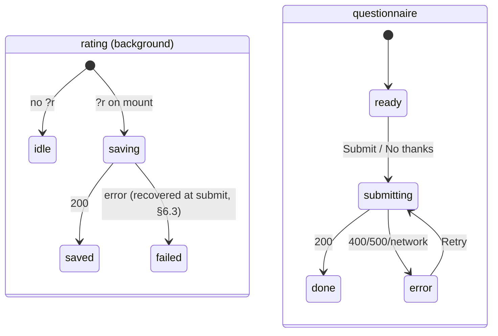
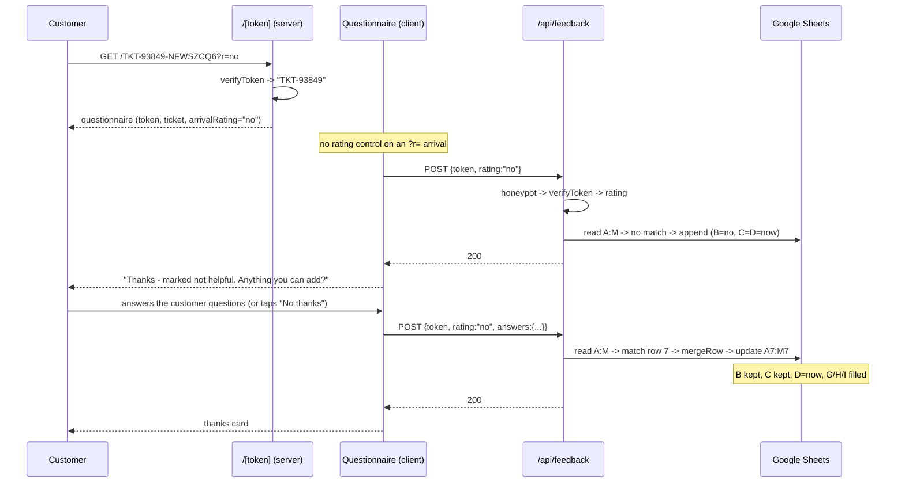

# Friday Ticket Feedback v2 — Software Design Document

**Status:** Ready to implement
**Owner:** Srijan · **Build agent:** Claude Code · **Last updated:** 27 Aug 2026

**References**
- Rationale & tradeoffs: [`friday_feedback_signed_links_hld.md`](friday_feedback_signed_links_hld.md) (HLD v0.2)
- Sender-side contract: [`friday_link_generation_spec.md`](friday_link_generation_spec.md)
- Evidence behind the questions: [`friday_fr_failure_taxonomy.md`](friday_fr_failure_taxonomy.md)
- Superseded baseline: [`friday_feedback_hld.md`](friday_feedback_hld.md) (v0.1, shipped)

This document is the *how*. It specifies module APIs, the exact order of
operations, the form's state machine, and the test plan. It does not re-argue
design decisions — those live in the HLD, cited as `HLD §n`.

---

## 1. Scope

| In | Out |
|---|---|
| `lib/token.js` — mint & verify signed link IDs | DevRev write-back |
| Route rename `app/[ticket]/` → `app/[token]/` | Link expiry / one-time links |
| Token-only `POST /api/feedback`, field-level merge | Dashboards, customer auth |
| Schema-driven questionnaire; rating recorded via API on arrival | A yes/no control in the UI (HLD §7.1) |
| Placeholder question set, one sheet column per question | The final question list (owner, HLD §13.4) |
| | A link-minting endpoint (HLD §3.3), rate limiting (HLD §2.5) |

**Terminology.** *ticket* = DevRev display id, `TKT-93849`. *tag* = 8-char
truncated HMAC. *token* = `<ticket>-<tag>`, the whole path segment. The token is
the only ticket-bearing input the server trusts. *rating* = the yes/no
helpfulness signal, an API field with no UI control. *answers* = the
questionnaire, keyed by question id.

---

## 2. File map

| File | Action | Notes |
|---|---|---|
| `lib/token.js` | **new** | §3. Server-only. No imports from client components. |
| `lib/token.test.js` | **new** | §12.1. `node --test`. |
| `lib/questions.js` | **new** | §4. Question schema + validation + column helpers. Single source of truth for form, API, and sheet headers. |
| `lib/questions.test.js` | **new** | §12.2. |
| `scripts/link.js` | **new** | §11.2. Manual/test link generation. |
| `app/[token]/page.jsx` | **moved** from `app/[ticket]/page.jsx` | §5 |
| `app/[token]/Questionnaire.jsx` | **moved** from `[ticket]/FeedbackForm.jsx` + rewritten | §6 |
| `app/api/feedback/route.js` | edit | §7 |
| `lib/sheets.js` | edit | §8 |
| `app/globals.css` | edit | chip + follow-up styles |
| `.env.local.example`, `README.md` | edit | §11.1 |
| `app/[ticket]/` | **deleted** | Must go in the same change (HLD §5). |

`package.json`: add `"test": "node --test"`. **No new dependencies.**

---

## 3. `lib/token.js`

### 3.1 Public API

| Export | Signature | Behavior |
|---|---|---|
| `makeToken` | `(ticket: string, scope?: '' \| 'i') => string` | Canonicalizes, throws `InvalidTicket` on a bad id, returns `TICKET-TAG` using the **primary** secret. `scope` defaults to `''` (customer); `'i'` mints the internal support-engineer link. |
| `verifyToken` | `(input: unknown) => {ticket, audience} \| null` | On a valid token returns the canonical ticket plus `audience` (`'customer'` \| `'agent'`), `null` otherwise. Never throws. |
| `canonicalTicket` | `(raw: string) => string \| null` | Trim + uppercase + regex; `null` if invalid. |

`verifyToken` returning `null` rather than throwing is deliberate: both call
sites (page shell, API) treat every failure identically, and a thrown error in a
server component would surface a 500 instead of the invalid-link state.

### 3.2 Implementation (normative)

```js
import { createHmac, timingSafeEqual } from 'node:crypto';

const CROCKFORD = '0123456789ABCDEFGHJKMNPQRSTVWXYZ';
const TICKET_RE = /^[A-Z0-9-]{3,40}$/;
const TAG_RE = /^[0-9ABCDEFGHJKMNPQRSTVWXYZ]{8}$/; // alphabet only => 8 ASCII bytes
const SCHEME = 'v1:';
const MAC_BYTES = 5;
const TAG_LEN = 8;
const MIN_TOKEN = 3 + 1 + TAG_LEN;   // 12
const MAX_TOKEN = 40 + 1 + TAG_LEN;  // 49

export class InvalidTicket extends Error {}

// Primary first; the rest are accepted on verify only (HLD §2.4).
function acceptedSecrets() {
  const primary = (process.env.FEEDBACK_LINK_SECRET || '').trim();
  const extra = (process.env.FEEDBACK_LINK_SECRETS_ACCEPTED || '')
    .split(',')
    .map((s) => s.trim())
    .filter(Boolean);
  return primary ? [primary, ...extra] : [];
}

export function canonicalTicket(raw) {
  if (typeof raw !== 'string') return null;
  const ticket = raw.trim().toUpperCase();
  return TICKET_RE.test(ticket) ? ticket : null;
}

// scope '' = customer link (byte-identical to the published v1 scheme),
// 'i' = internal support-engineer link. Same ticket, unforgeable across scopes.
const SCOPES = { '': 'v1:', i: 'v1:i:' };

function tagFor(ticket, secret, scope) {
  const mac = createHmac('sha256', secret).update(SCOPES[scope] + ticket).digest();
  let n = 0;
  for (let i = 0; i < MAC_BYTES; i += 1) n = n * 256 + mac[i]; // 40 bits, exact
  let tag = '';
  for (let i = TAG_LEN - 1; i >= 0; i -= 1) {
    tag += CROCKFORD[Math.floor(n / 32 ** i) % 32];
  }
  return tag;
}

export function makeToken(rawTicket, scope = '') {
  const ticket = canonicalTicket(rawTicket);
  if (!ticket) throw new InvalidTicket(`not a display ticket id: ${rawTicket}`);
  const [primary] = acceptedSecrets();
  if (!primary) throw new InvalidTicket('FEEDBACK_LINK_SECRET is not set');
  return `${ticket}-${tagFor(ticket, primary, scope)}`;
}

export function verifyToken(input) {
  if (typeof input !== 'string') return null;
  const s = input.trim().toUpperCase();
  if (s.length < MIN_TOKEN || s.length > MAX_TOKEN) return null;
  if (s[s.length - TAG_LEN - 1] !== '-') return null;

  const ticket = canonicalTicket(s.slice(0, -(TAG_LEN + 1)));
  // Crockford leniency applies to the TAG ONLY. Never to the ticket — "INC-101"
  // and "1NC-101" are different tickets.
  const tag = s.slice(-TAG_LEN).replace(/[IL]/g, '1').replace(/O/g, '0');
  if (!ticket || !TAG_RE.test(tag)) return null;

  const got = Buffer.from(tag, 'ascii');
  for (const secret of acceptedSecrets()) {
    for (const scope of ['', 'i']) {
      const want = Buffer.from(tagFor(ticket, secret, scope), 'ascii');
      if (got.length === want.length && timingSafeEqual(got, want)) {
        return { ticket, audience: scope === 'i' ? 'agent' : 'customer' };
      }
    }
  }
  return null; // also the path taken when no secret is configured — fail closed
}
```

### 3.3 Behavior table

Under the docs' test secret `dummy_secret_for_test_vectors_only`:

| Input | Result | Why |
|---|---|---|
| `TKT-93849-NFWSZCQ6` | `{ticket:"TKT-93849", audience:"customer"}` | Valid, customer scope — **the published vector, unchanged** |
| `TKT-93849-2M6YQW80` | `{ticket:"TKT-93849", audience:"agent"}` | Valid, internal scope |
| `tkt-93849-nfwszcq6` | `{ticket:"TKT-93849", audience:"customer"}` | Case-insensitive |
| `TKT-93849-NFWSZCQ0` | `null` | Tag tampered |
| `TKT-93849` | `null` | No tag; length < 12 |
| `TKT-93849-NFWSZCQU` | `null` | `U` not in the alphabet |
| `TKT-93849-NFWSZCQ6` with only an old secret in `FEEDBACK_LINK_SECRETS_ACCEPTED` | valid | Rotation window |
| anything, `FEEDBACK_LINK_SECRET` unset | `null` | **Fail closed** |
| `123456789012` (12 chars, no `-` at −9) | `null` | Shape check |

### 3.5 Audience is authenticated, not a query param

The two scopes exist so the internal question set is unreachable by URL editing.
`?a=agent` would have been one line cheaper and would have let a customer render
option text like *"Blamed the wrong side — us / their data / the carrier"*.
Folding the scope into the MAC input costs one extra character and makes it
unforgeable. The customer scope deliberately keeps the **unprefixed** v1 input so
every vector already published to the Friday side stays valid.

### 3.4 Traps

- The tag's Crockford normalization must not touch the ticket (see the comment
  in §3.2). This is the one place a careless refactor changes which tickets
  exist.
- `timingSafeEqual` throws on unequal lengths — `TAG_RE` guarantees 8 ASCII
  bytes, and the explicit length compare stays as a belt-and-braces guard.
- A missing secret must produce `null`, never "accept everything". §12.1 case 7
  exists solely to keep that true.
- `tagFor` output must never change without a `SCHEME` bump — every link already
  in a customer's inbox depends on it (HLD §2.2).

---

## 4. `lib/questions.js`

One file drives the form, server-side validation, and the sheet's column
headers. Swapping in the real question list (HLD §13.4) touches nothing else.

### 4.1 Schema

The question set, its rationale and the evidence behind every option live in
HLD §7.3 and [`friday_fr_failure_taxonomy.md`](friday_fr_failure_taxonomy.md).
This section specifies only the mechanics.

Three questions. Ids are **semantic and append-only**. The four engineer
questions and the `audience` field are deferred with the internal form
(HLD §13.4) — documented there, not in the code.

| id | audience | type | notes |
|---|---|---|---|
| `cust_problem` | customer | multi, max 3 | `showWhen: 'no'` |
| `outcome` | customer | single | ungated |
| `cust_needed` | customer | text 1000 | `showWhen: 'no'` |
| `fr_disposition` | agent | single | ungated |
| `rca_value` | agent | single | ungated |
| `rca_delta` | agent | multi, max 3 | 11 options |
| `actual_cause` | agent | text 1000 | ungated |

```js
export const PREFIX = ['ticket', 'rating', 'submitted_at', 'updated_at', 'customer', 'user_agent'];
export const HEADER_ROW = [...PREFIX, ...QUESTIONS.map((q) => q.id)];   // A..M
export const LAST_COL = colLetter(HEADER_ROW.length - 1);               // 'M'

/** Questions to render for one link: audience from the token scope, showWhen from ?r. */
export function questionsFor(audience, rating) {
  return QUESTIONS.filter(
    (q) => q.audience === audience && (!q.showWhen || q.showWhen === rating),
  );
}
```

| Type | Renders as | Stored as |
|---|---|---|
| `single` | radiogroup, roving tabindex | the chosen option `value` |
| `multi` | `aria-pressed` toggle chips, capped by `max` | option values comma-joined, **schema order** |
| `text` | textarea + counter, capped by `maxLength` | the trimmed string |

`audience` and `showWhen` are **display rules, not validation**:
`sanitizeAnswers` accepts any id in the schema regardless of scope or rating.
Server-side enforcement would protect nothing — a caller holding a valid token
can write anything the schema allows — and it would break the case where a
rating write is lost but the answers land (§6.3). The protection that matters is
that `audience` is selected by the **authenticated token scope** (§3.5), so a
customer editing the URL cannot render the engineer's option text.

### 4.2 `sanitizeAnswers` (normative)

```js
/** Answers -> { [id]: string }, one sheet cell per question. Unknown keys and
 *  unknown option values are dropped. An absent id stays absent (= don't touch). */
export function sanitizeAnswers(input) {
  if (!input || typeof input !== 'object' || Array.isArray(input)) return {};
  const out = {};
  for (const q of QUESTIONS) {
    if (!(q.id in input)) continue;
    const raw = input[q.id];
    if (q.type === 'text') {
      if (typeof raw !== 'string') continue;
      out[q.id] = stripControls(raw).slice(0, q.maxLength ?? 1000).trim();
      continue;
    }
    const allowed = q.options.map((o) => o.value);
    if (q.type === 'single') {
      if (typeof raw !== 'string' || !allowed.includes(raw)) continue;
      out[q.id] = raw;
      continue;
    }
    if (q.type === 'multi') {
      if (!Array.isArray(raw)) continue;
      const kept = new Set(raw.filter((v) => typeof v === 'string' && allowed.includes(v)));
      out[q.id] = allowed.filter((v) => kept.has(v)).slice(0, q.max ?? 4).join(',');
    }
  }
  return out;
}
```

`stripControls` is the existing codepoint stripper lifted out of
`app/api/feedback/route.js` (keeps tab/newline/CR). Move it here; the route
imports it.

**Key distinction:** an id *absent* from the payload means "leave that cell
alone"; an id present with an empty string is a real answer that *clears* the
cell. That is what lets the questionnaire be submitted twice without a
half-filled second submit wiping the first.

### 4.3 `colLetter` (normative)

```js
/** 0-based column index -> A1 letter. 0->A, 25->Z, 26->AA. */
export function colLetter(index) {
  let n = index;
  let out = '';
  do {
    out = String.fromCharCode(65 + (n % 26)) + out;
    n = Math.floor(n / 26) - 1;
  } while (n >= 0);
  return out;
}

export const LAST_COL = colLetter(HEADER_ROW.length - 1); // 'M' with 7 questions
```

Needed because the sheet's width is now derived from the schema. The `AA`+ case
is not decoration: past 20 questions a naive `String.fromCharCode(65 + i)` emits
punctuation and every range silently breaks.

---

## 5. `app/[token]/page.jsx`

```
export default async function TokenPage({ params, searchParams })
```

1. `const { token } = await params` — the raw path segment.
2. `const verified = verifyToken(token)` → `{ticket, audience}` or `null`.
3. `verified === null` → render the existing invalid-link card verbatim (same copy
   as v0.1: *"This link has expired or is invalid…"*). **No form, no POST
   target, no ticket echoed back.**
4. Otherwise render `<Questionnaire token={token} ticket={verified.ticket} audience={verified.audience} arrivalRating={…} customer={…} />`.

Props: `token` is passed through so the client can POST it back; `ticket` is
**display only**. The secret never crosses the boundary — `lib/token.js` is
imported by the server component only.

`arrivalRating` = `normalizeRating(searchParams.r)` → `'yes' | 'no' | ''`. It is
*not* a form value — nothing on the page can change it (HLD §7.1); it is the
signal the client banks on mount (§6.2). `customer` = `searchParams.c` — still
untrusted label metadata (HLD §6.3).

---

## 6. `app/[token]/Questionnaire.jsx`

Renamed from `FeedbackForm.jsx` — it no longer collects a rating, it asks
questions.

### 6.1 Two independent pieces of state

The rating write and the questionnaire write are separate concerns and must not
gate each other: the customer can start answering while the arrival POST is
still in flight.

```js
const [ratingStatus, setRatingStatus] = useState('idle');  // idle | saving | saved | failed
const [formStatus, setFormStatus]     = useState('ready'); // ready | submitting | done | error
const [answers, setAnswers]           = useState({});      // { [id]: string | string[] }
```



| `formStatus` | Rendered |
|---|---|
| `ready` | Rating banner (if any) + questions + Submit + "No thanks" |
| `submitting` | Submit disabled, "Sending…"; inputs stay readable |
| `done` | Thanks card; questions replaced, not reset |
| `error` | Inline `role="alert"` + Retry; every answer preserved |

`ratingStatus` renders only as a quiet banner above the questions — *"Thanks —
you marked this response as not helpful. Anything you can add?"* — never as a
control.

### 6.2 Arrival POST

```js
const fired = useRef(false);
useEffect(() => {
  if (fired.current || !arrivalRating) return;
  fired.current = true;   // also guards React StrictMode's double effect in dev
  setRatingStatus('saving');
  post({ token, rating: arrivalRating })
    .then(() => setRatingStatus('saved'))
    .catch(() => setRatingStatus('failed'));
}, [arrivalRating]);
```

Client-side on mount so HTML-only email scanners record nothing (HLD §7.2).
Idempotent — a reload re-writes the same value into the same row.

### 6.3 Submit

```js
post({ token, rating: arrivalRating || undefined, answers, customer, website: '' })
```

**The rating is resent with the questionnaire whenever it is known.** That is the
entire failure handling for §6.2: if the arrival POST was lost, the submit
recovers it; if it succeeded, the merge writes the same value again, which is a
no-op. No retry logic, no error branch, one rule.

`answers` is sent as the raw client shape (`multi` as an array); the server
canonicalizes. Only ids the customer actually touched are included, so an
untouched question never overwrites a cell (§4.2).

"No thanks" posts the same payload with `answers: {}` and lands on `done` — the
rating is already banked, so the exit is honest rather than a dead link.

### 6.4 Rendering questions

Map `questionsFor(audience, arrivalRating)` in order — one `<fieldset>` per question, label
as `<legend>`, types per §4.1. All questions are optional; there is no
required-field validation, client or server (HLD §7.4).

Three modes (HLD §7.1): `?r=yes` renders a thank-you card and no form at all;
`?r=no` renders `questionsFor('no')` with no rating control; a bare link renders
the rating control plus `questionsFor(selectedRating)`, so the reason questions
appear and disappear as the selection changes.

Only questions **currently returned by the filter** go into the submit payload,
so a chip picked before switching back to Yes is never written. An unrendered
question never appears in `answers`, so its cell is untouched (§4.2's
absent-means-don't-touch rule).

`labelFor(q, rating)` returns `q.labelNo` when the rating is `no` and the
question defines one — one column, one meaning, a sharper prompt once we know the
response missed.

FORM mode is the only one that validates client-side: a rating must be chosen
("Please choose Yes or No."). The comment is optional everywhere.

`ponytail:` a `switch` on `q.type` inside one component, not a component per
type. Three types, ~15 lines each; a registry/factory here would be indirection
for nothing.

### 6.5 Accessibility

Carried over from v0.1 and applied per type: `single` is a `role="radiogroup"`
with roving tabindex and arrows/Home/End; `multi` is a `role="group"` of
`aria-pressed` buttons; `text` keeps its counter wired via `aria-describedby`.
One persistent `sr-only` `aria-live="polite"` region announces both the rating
banner text and the submit outcome; focus moves to the thanks heading on `done`.
Visible focus rings, `prefers-reduced-motion`, 360 px.

---

## 7. `app/api/feedback/route.js`

Runtime `nodejs`, `dynamic = 'force-dynamic'` (unchanged).

### 7.1 Pipeline — order is normative (HLD §6.4)

| # | Step | Failure |
|---|---|---|
| 1 | `await request.json()` | `400 invalid_json` |
| 2 | Honeypot: `website` non-empty | `200 {ok:true}`, **no write** |
| 3 | `ticket = verifyToken(body.token)` | `400 invalid_link` |
| 4 | `'rating' in body \|\| 'answers' in body` | `400 empty_payload` |
| 5 | If `rating` present: ∈ {`yes`,`no`} after trim+lowercase | `400 invalid_rating` |
| 6 | `answers = sanitizeAnswers(body.answers)` | never fails; unknown ids/values dropped |
| 7 | `customer = sanitizeShort(body.customer, 120)` | never fails |
| 8 | `upsertFeedback({ ticket, rating, answers, customer, userAgent, now })` | `500 server_error` (logged) |

Steps 1–7 are pure CPU. Nothing reaches Google until a MAC has verified.

Two rules a reviewer should check by grep:

- **`body.ticket` must not appear in this file.** The ticket comes only from
  step 3.
- **`rating` is optional.** `'rating' in body` gates step 5 — an absent rating is
  not an error, and must not be coerced to `''` and passed down, because
  `upsertFeedback` distinguishes "absent" from "empty" (§8.3).

### 7.2 Responses

| Code | Body |
|---|---|
| 200 | `{ok:true}` |
| 400 | `{ok:false,error:"invalid_json"\|"invalid_link"\|"invalid_rating"\|"empty_payload"}` |
| 500 | `{ok:false,error:"server_error"}` |

`invalid_ticket` is retired. Malformed token and bad MAC return the identical
code and message — no oracle for which half was wrong.

An `answers` object whose every key was dropped is **200, not 400**: the write
still bumps `updated_at`, and a schema change landing while a customer had the
page open must not fail their submit (HLD §6.3).

---

## 8. `lib/sheets.js`

### 8.1 Schema

`HEADER_ROW` and `LAST_COL` are imported from `lib/questions.js` (§4) — this file
no longer owns the column list.

| Col | Field | Example |
|---|---|---|
| A | ticket (upsert key) | `TKT-93849` |
| B | rating | `no` — **written only when present** |
| C | submitted_at | `2026-08-27T10:14:02.118Z` — set once, on create |
| D | updated_at | `2026-08-27T10:15:31.902Z` — every write |
| E | customer | *(usually blank)* |
| F | user_agent | `Mozilla/5.0…` |
| G–I | customer answers | `cust_problem` (empty when the rating was `yes`), `outcome`, `cust_needed` |
| J–M | engineer answers | `fr_disposition`, `rca_value`, `rca_delta`, `actual_cause` — empty until the internal link is used |

### 8.2 Changes from v0.1

1. **Computed ranges.** Header `A1:{LAST_COL}1`; scan and append `A:{LAST_COL}`;
   update `A{n}:{LAST_COL}{n}`. Nothing is hard-coded to `F` any more. Note
   `values.update` rejects a values array narrower than its range, which is
   exactly why `colLetter` has to be right.
2. **Self-healing header:** rewrite when the existing row is missing **or shorter
   than** `HEADER_ROW`, so appending a question backfills the header on the next
   write.
3. **Read `A:{LAST_COL}`, not `A:A`.** The row scan already costs one request;
   returning the full row makes the merge (§8.3) free.
4. **`comment` column removed** — free text is a `text` question.
5. `neutralizeFormula` applied to `customer`, `user_agent`, and every question
   cell. Not to `ticket` (the match key, already constrained to `[A-Z0-9-]`).

### 8.3 `mergeRow` — field-level merge (normative)

```js
/** Only the fields present in the patch overwrite the row. */
export function mergeRow({ existing, ticket, rating, answers, customer, userAgent, now }) {
  const row = [...(existing || [])];
  while (row.length < HEADER_ROW.length) row.push(''); // pad rows from an older schema
  row[0] = ticket;
  if (rating) row[1] = rating;
  row[2] = row[2] || now;   // submitted_at: set once
  row[3] = now;             // updated_at: every write
  if (customer) row[4] = customer;
  if (userAgent) row[5] = userAgent;
  QUESTIONS.forEach((q, i) => {
    if (q.id in answers) row[PREFIX.length + i] = answers[q.id];
  });
  return row;
}
```

The two invariants this exists to protect, both covered by tests (§12.2):

- a **questionnaire** write must not blank a rating recorded on arrival;
- a **rating** write must not blank answers already submitted.

### 8.4 `upsertFeedback`

```js
upsertFeedback({ ticket, rating, answers, customer, userAgent, now })
  -> { action: 'appended' | 'updated', row?: number }
```

1. `ensureHeader()`.
2. `values.get(A:{LAST_COL})`; scan column A from row 2 for `ticket`.
3. `row = mergeRow({ existing: match, ... })`.
4. Match → `values.update(A{n}:{LAST_COL}{n})`; no match → `values.append`.

`submittedAt` is gone from the parameters — the function owns create-vs-update
semantics and the caller passes one `now`.

**Race, restated.** The read-then-write upsert is not atomic (the Sheets values
API has no compare-and-set), and there are now two writers. A rating POST and a
questionnaire POST landing in the same instant can each merge onto the same
pre-read row; the later write wins and drops the earlier one's field. In practice
they are seconds apart — tap, page load, fill, submit.
`ponytail: accepted ceiling; short per-ticket lock (e.g. Redis) if it ever bites.`

---

## 9. Sequences

### 9.1 Tap, then answer (the common path)



### 9.2 Forged link

```mermaid
sequenceDiagram
    participant X as Stranger
    participant P as /[token]
    participant A as /api/feedback
    X->>P: GET /TKT-00001
    P->>P: verifyToken → null (no tag)
    P-->>X: "This link is invalid" — no form
    X->>A: POST {ticket:"TKT-00001", rating:"yes"}
    A->>A: body.ticket ignored; token undefined → verifyToken → null
    A-->>X: 400 invalid_link
    Note over A: no Sheets call, nothing written
```

---

## 10. Error copy mapping

| Server code | Client copy | Retry offered |
|---|---|---|
| *(page-level)* `verifyToken → null` | "This link has expired or is invalid. Please use the feedback link from your support email." | no — link is dead |
| `invalid_link` | same as above, inline | no |
| `invalid_rating` | "Something went wrong. Please try again." | yes — client bug, not a user error (there is no rating control to correct) |
| `empty_payload` | "Something went wrong. Please try again." | yes — client bug |
| `invalid_json` | "Something went wrong. Please try again." | yes |
| `server_error` | "We could not save your feedback. Please try again shortly." | yes |
| network throw | "Something went wrong. Please try again." | yes |

---

## 11. Configuration & rollout

### 11.1 Environment

| Var | Required | Notes |
|---|---|---|
| `FEEDBACK_LINK_SECRET` | **yes** | 32 bytes of entropy; `openssl rand -base64 32` or `-hex 32` — the key is a literal utf8 string, so the encoding is cosmetic. A distinct value per environment; the same value on the Friday side of that environment. A mismatch is silent — links just read as invalid. |
| `FEEDBACK_LINK_SECRETS_ACCEPTED` | no | Comma-separated, verify-only (HLD §2.4). |
| `APP_BASE_URL` | link gen | No trailing slash. |
| `GOOGLE_SERVICE_ACCOUNT_KEY`, `SHEET_ID`, `SHEET_TAB` | yes | Unchanged. |

`.env.local.example` gains the first three with empty values. README documents
the generation command, the §12 test-vector table, and the rotation order (add to
the app's accepted list **before** switching Friday, or outstanding links die).

### 11.2 `scripts/link.js`

`node scripts/link.js TKT-93849` → prints `url`, `?r=yes`, `?r=no`. Thin CLI over
`makeToken` + `APP_BASE_URL`; for manual sends and smoke tests, not for the
Friday pipeline (which mints inline — HLD §3).

### 11.3 Cutover

No migration. The app has never served traffic (the Sheets service account is
still unprovisioned per the v0.1 checklist), so there are zero links in the wild:
delete `app/[ticket]/`, ship `app/[token]/`, done. Order of operations:

1. Set `FEEDBACK_LINK_SECRET` locally and on Vercel (Preview **and** Production —
   differing values across environments is the likeliest "why is my link
   invalid" during testing).
2. Deploy. Verify a `scripts/link.js` URL against the deployed host.
3. Hand `friday_link_generation_spec.md` and the secret to the Friday pipeline
   owner (secret via a secret manager, not the doc).

---

## 12. Test plan

### 12.1 `lib/token.test.js` — `node --test`

Secret for all cases: `dummy_secret_for_test_vectors_only`.

| # | Case | Expected |
|---|---|---|
| 1 | **Known-answer:** `makeToken('TKT-93849')` | `TKT-93849-NFWSZCQ6` — must never change, it is published to the Friday side |
| 1a | **Known-answer:** `makeToken('TKT-93849','i')` | `TKT-93849-2M6YQW80` |
| 1b | A customer token verified → `audience:'customer'`; internal → `'agent'`; neither verifies as the other | scopes unforgeable across |
| 2 | `makeToken('TKT-1')`, `makeToken('ABC')` | `TKT-1-FP7NCCMS`, `ABC-YA3HBSP0` |
| 3 | `verifyToken(makeToken(t))` for each of the above | canonical ticket back |
| 4 | Lowercase token; `I`/`L`/`O` substituted in the tag | canonical ticket back |
| 5 | One tag char flipped | `null` |
| 6 | `'TKT-93849'`; `'-NFWSZCQ6'`; `''`; `null`; `{}` | `null` |
| 7 | **`FEEDBACK_LINK_SECRET` unset** | `null` for a previously-valid token |
| 8 | Token valid under `FEEDBACK_LINK_SECRETS_ACCEPTED` only | canonical ticket back |
| 9 | Ticket-part leniency: `1NC-101` ≠ `INC-101` | different tokens; neither verifies as the other |
| 10 | `makeToken('don:core:…:ticket/93849')`, `'AB'`, 41 chars | throws `InvalidTicket` |

Case 1 is the important one: it pins the algorithm so a refactor can't silently
invalidate every link in a customer's inbox. It is the same vector published to
the Friday side, so the two implementations are locked to each other.

### 12.2 `lib/questions.test.js` — `node --test`

| # | Case | Expected |
|---|---|---|
| 1 | `sanitizeAnswers` — unknown id; unknown option value | dropped |
| 2 | `multi` with dupes + an unknown value | deduped, schema order |
| 3 | `multi` over `max` | capped |
| 4 | `multi` given a bare string; `single` given a number | dropped (type mismatch) |
| 5 | `text` over `maxLength`; padded whitespace | truncated; trimmed |
| 6 | `text: ''` | kept — an explicit clear, not an absence |
| 7 | non-object / array / `null` input | `{}` |
| 8 | `colLetter` 0, 6, 25, 26, 51, 52 | `A`, `G`, `Z`, `AA`, `AZ`, `BA` |
| 9 | `HEADER_ROW`, `LAST_COL` | 6 prefix + 7 ids; `M` |
| 9a | `questionsFor('customer','no')` / `('customer','yes')` / `('customer','')` | 3 / `outcome` only / `outcome` only |
| 9b | `questionsFor('agent','')` | the 4 engineer questions |
| 9c | `sanitizeAnswers` accepts an out-of-audience id | kept — display rule, not validation |
| 10 | **`mergeRow`: questionnaire write over an existing rating** | rating preserved |
| 11 | **`mergeRow`: rating write over existing answers** | answers preserved |
| 12 | `mergeRow` twice | `submitted_at` fixed, `updated_at` advances |
| 13 | `mergeRow` on a short row written under a smaller schema | padded to `HEADER_ROW` width, old values intact |

Cases 10–12 are the ones worth having. They are the invariants that two
independent writers on one row can silently violate, and the failure is
invisible — a blanked cell looks exactly like a customer who didn't answer.

### 12.3 Integration (manual, against `npm run dev`)

| Check | Expected |
|---|---|
| `GET /<valid token>?r=yes` | thank-you card only; **no rating control, no questions** in the HTML; one row, column B = `yes` |
| `GET /<valid token>?r=no` | three questions; **no rating control** in the HTML |
| `GET /<valid token>` (no `?r`) | classic form: Yes/No + comment only; reason questions absent until No is picked |
| …pick No | 6 reason chips + `outcome` + the sharpened comment label appear |
| …switch back to Yes | they collapse; a chip picked meanwhile is **not** submitted |
| …Yes + comment, submit | column B = `yes` **and** `cust_needed` filled |
| …submit with no rating chosen | blocked client-side: "Please choose Yes or No." |
| Reload the same URL | still one row, `updated_at` bumped, `submitted_at` unchanged |
| Submit the questionnaire after arriving with `?r=no` | column B still `no` |
| `POST {token, rating:'yes'}` alone (curl, no browser) | `200`, one row — the machine path |
| Then `POST {token, answers:{...}}` | same row, rating intact |
| Reverse order: answers first, then rating | same row, answers intact |
| `GET /TKT-93849` | invalid card, no form in the HTML |
| `GET /<token with flipped tag>` | invalid card |
| `POST` `{ticket:'TKT-93849',rating:'yes'}` (no token) | `400 invalid_link`, no row |
| `POST` valid token, no `rating`, no `answers` | `400 empty_payload`, no row |
| `POST` valid token + `answers:{bogus:'x'}` | `200`, only `updated_at` moves |
| `POST` valid token + `website:'x'` | `200`, no row |
| Append an 8th question to the schema, then write | header gains column N; older rows keep their values |
| Customer link answered, then internal link answered | **one row**, both audiences' columns filled, `submitted_at` unchanged |
| Open an internal-scope URL with the customer tag | invalid card |
| `?r=no` vs `?r=yes` vs no `?r` | 3 questions / `outcome` only / `outcome` only |
| `FEEDBACK_LINK_SECRET` unset, restart | every link invalid (**not** every link accepted) |
| `grep -r FEEDBACK_LINK_SECRET .next/static` | no match |
| Response headers | `X-Robots-Tag`, `X-Frame-Options`, `X-Content-Type-Options`, `Referrer-Policy` intact |
| 360 px viewport, keyboard only | chips and radiogroup fully operable |

`next build` clean; `npm test` green.

---

## 13. Observability

- `console.error` on: Sheets failure (existing), and a **one-line warn on boot if
  `FEEDBACK_LINK_SECRET` is unset** — fail-closed is silent by design, and
  "every link is invalid" is otherwise indistinguishable from a bad secret.
- **Never log the secret.** Do not log a failed token either — it adds nothing
  (the tag is either right or wrong) and a valid one is a capability.
- Vercel access logs necessarily contain tokens, i.e. ticket ids. That is the
  same exposure as v0.1's `/TKT-93849` and is accepted (HLD §2.5).
- Invalid-link volume, if it ever needs watching, is visible as the 400 rate in
  Vercel's function logs. No counter is being built.

---

## 14. Traceability

| HLD § | Requirement | SDD § | File |
|---|---|---|---|
| §2.2 | Deterministic HMAC token | §3.2 | `lib/token.js` |
| §2.3 | Stateless verification | §3.2, §3.3 | `lib/token.js` |
| §2.4 | Key rotation | §3.2 `acceptedSecrets` | `lib/token.js` |
| §3 | Friday mints offline | — | [`friday_link_generation_spec.md`](friday_link_generation_spec.md) |
| §5 | One route, unsigned path removed | §2, §5, §11.3 | `app/[token]/`, delete `app/[ticket]/` |
| §6 | Token-only API, ordered validation | §7.1 | `app/api/feedback/route.js` |
| §6.2 | Field-level merge | §8.3 | `lib/sheets.js` |
| §7.1 | Yes/no is API-only, no UI control | §5, §6.1 | `page.jsx`, `Questionnaire.jsx` |
| §7.2 | Rating banked on arrival | §6.2, §6.3 | `Questionnaire.jsx` |
| §2.2, §7.3 | Two audiences, scoped tokens, `showWhen` gating | §3.2, §3.5, §4.1, §6.4 | `lib/token.js`, `lib/questions.js` |
| §8 | Sheet schema, computed width | §8.1, §8.2 | `lib/sheets.js`, `lib/questions.js` |
| §11 | Test plan incl. known-answer vector | §12.1, §12.2 | `lib/token.test.js`, `lib/questions.test.js` |

---

## 15. Build constraints

- Create `docs/sdd/friday_feedback_signed_links_hld_checklist.md` before writing
  code (CLAUDE.md workflow), derived from §2's file map and §12's test plan.
- Do not commit or push — the owner reviews and commits.
- No new dependencies; no new services.
- `app/[ticket]/` is deleted in the same change that adds `app/[token]/`.
- The question set in `lib/questions.js` is **proposed, pending sign-off**
  (HLD §13.5), and every option traces to an observed correction in
  [`friday_fr_failure_taxonomy.md`](friday_fr_failure_taxonomy.md) — do not add,
  merge or reword options without checking that doc, because the labels are the
  measurement. Build against it, but expect labels and options to change — that
  is a data edit in one file. Do not add questions of your own invention, and do
  not add a "shall we follow up?" question: there is nothing to honour it with
  until DevRev write-back exists (HLD §7.3).
